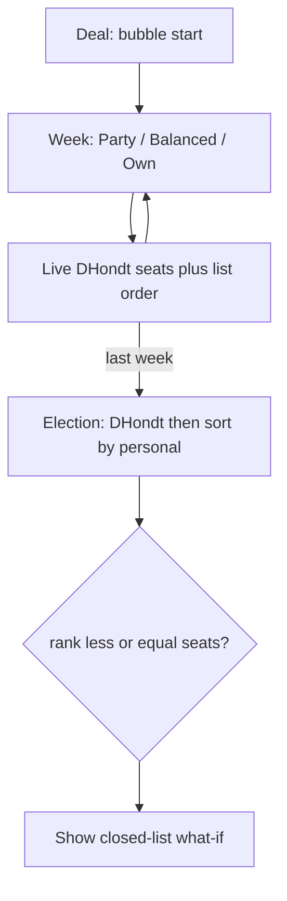

# Open-list campaign game

A short campaign game that teaches open-list PR: party vote share sets how many seats you get; personal support sets who fills them. Win by getting elected. All three weekly choices can be the right call, depending on the deal.

## Teaching point

Open list is two coupled counts:

1. **Party votes** (D’Hondt) → how many seats the party wins.
2. **Personal preference** → who fills those seats (list order can change).

Closed list shares (1) and freezes (2). The player feels that by sitting on a list with a **live cutoff**: “if we voted today, seats would end here.”

Win: **you are elected** (your rank ≤ party seats after election). Copy should not scold party-first or self-first play. Starting position decides which mix works.

## Player loop

You are a named candidate on a fruit party list, a few weeks from election.

Each week pick one:

| Choice | Typical effect |
|--------|----------------|
| **Party** | Party vote share up; your personal score barely moves; list-mates may pass you |
| **Balanced** | Modest party gain and modest personal gain |
| **Own support** | You climb; party share flat or slightly down (attention split); rivals stall |

After the last week: election night. D’Hondt on party shares, then sort your list by personal scores. Confetti if you got in.

**Closed-list “what if”** on the same night (same party seats, **original** list order): would you have gotten in anyway? That is the mechanism beat, not a second win condition.

## Deal (so all three choices stay useful)

Abstract toy chamber (not 199 seats): **21 seats**, **4 parties**, **8 names on your list**.

Generate until you start **on the bubble** (expected seats ≈ your rank, ±1). Mix three opening flavors so no single strategy dominates:

- **Climb needed:** party is safe (~4 seats), you are #5–6 → own support is the path.
- **Seats needed:** you are #2–3, party is short (~2 seats) → party campaign is the path.
- **Both tight:** rank ≈ expected seats → balanced (or a mix) is the path.

Rivals on your list have their own personal scores and drift a little each week (they campaign too). Other parties’ shares fill to 100%.

## What not to build

- No Hungary map. Gerrymander is geography; this is a **list + cutoff**.
- Do not reuse `src/engines/openList.ts` as-is (toy `🍎-1` names, 199-seat sim). Do reuse `dhondt` from `src/engines/shared.ts` so party seats match the rest of the site.
- Keep syspick’s “List = open and closed seats” as-is (same D’Hondt). This game is the open-list-only explainer.

## UI (match existing games)

Same chrome as SysPick / Gerrymander: back link, title, `info-panel gerry-brief`, rules dialog.

**During weeks**

- Party card: fruit, name, vote %, projected seats (live D’Hondt).
- List: 8 rows, **you** highlighted (strong border + faint fill, like SysPick). Horizontal **cutoff** between last-in and first-out.
- Three action buttons + week dots (`SegmentDots`).
- One-line consequence after each pick (party % / your rank), not a lecture.

**Election night**

- Projected cutoff locks to real seats.
- You in / you out.
- Closed-list counterfactual line: same seats, frozen original order.

**Compact (≤720px):** tabs **List | Campaign** (list + cutoff first); election night **List | Result**. Keep site bottom nav.

## Names and wiring

- Module: `src/exercises/openlist/` (`types.ts`, `generate.ts`, `score.ts`).
- Page: `src/pages/OpenListGame.tsx`.
- Routes: `/games/openlist` + `/exercises/openlist` redirect in `src/App.tsx`.
- Hub card in `src/pages/Exercises.tsx`.
- CTA on the **list** section of `src/pages/Systems.tsx` (gerrymander stays on local; syspick stays under the intro). Open-list detail page can use the same button.
- i18n: `ex.openlist.*` HU+EN (cardBlurb = mechanism; `rulesL*` = in-world brief; `rulesP*` = how-to). Working titles: **Listahely** / **List place** (easy to change).
- Docs: subsection in `docs/features/games.md` + hub mention in `docs/OVERVIEW.md`. Compact C/B in the games doc.

## Build todos

- Add exercises/openlist types, generate (bubble deals + three flavors), score (D’Hondt + list order + closed-list what-if)
- OpenListGame page: brief, live list+cutoff, three weekly actions, election reveal
- Routes, hub card, list-section CTA, HU/EN copy, games.md + OVERVIEW

